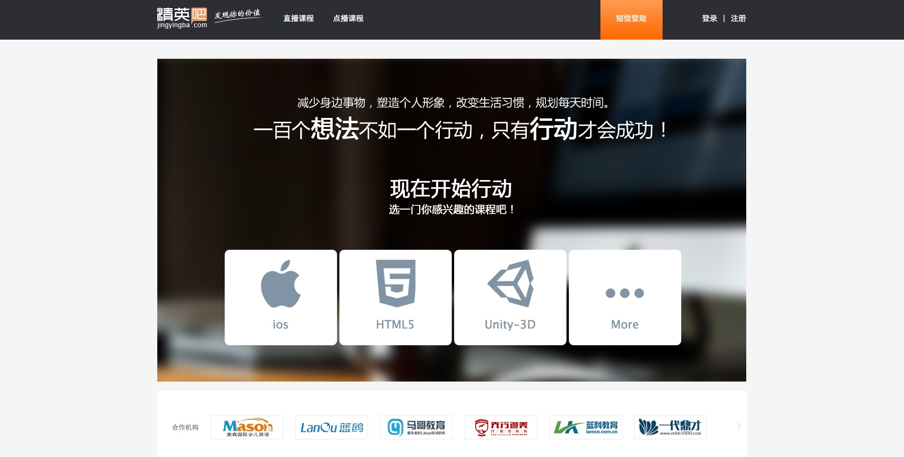

# jingyingba
## 精英吧

#### 基于mogodb和express实现的前后端交互，登陆注册以及内部的基本交互都以实现，主要负责html，css和js部分

通过jade编写html，sass编写的css，js依旧是纯原生js

## 首页

##登陆页面

## 课程页面

####打开方法
1. 先打开控制台进入mongodb/bin 
2. 输入./mongod
3. 再重开一个控制台进入jingyingba
4. 输入npm start
5. 然后在浏览器中输入地址http://127.0.0.1:3000/